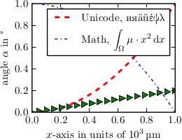

matplotlib-backend-pgf
======================

A backend for matplotlib drawing Pgf pictures for use with xelatex. Provides better unicode support and more consistent appearance of fonts.

Seed [Demo document](demo/demo.pdf) for a comparison with existing backends.

